# 微服务架构知识点

> 最后更新：2026年3月10日

---

## 微服务架构全景图

```mermaid
graph TB
    %% ========== 外部流量入口 ==========
    User["👤 用户 / 客户端"]
    User -->|"HTTPS 请求"| GW

    %% ========== 网关层 ==========
    subgraph Gateway["🌐 网关层"]
        GW["Spring Cloud Gateway<br/>路由 · 鉴权 · 限流"]
        GW_Sentinel["Sentinel<br/>入口流控 · 熔断"]
        GW --- GW_Sentinel
    end

    %% ========== 微服务层 ==========
    subgraph Services["⚙️ 微服务层（Spring Boot 应用）"]
        direction LR
        SvcA["📦 订单服务<br/>Order Service"]
        SvcB["📦 商品服务<br/>Product Service"]
        SvcC["📦 库存服务<br/>Inventory Service"]
        SvcD["📦 用户服务<br/>User Service"]
        SvcE["📦 支付服务<br/>Pay Service"]
    end

    GW -->|"路由转发"| SvcA
    GW -->|"路由转发"| SvcB
    GW -->|"路由转发"| SvcC
    GW -->|"路由转发"| SvcD
    GW -->|"路由转发"| SvcE

    %% ========== 服务间调用 ==========
    subgraph RPC["🔗 服务间通信"]
        Feign["OpenFeign<br/>声明式 HTTP 调用"]
        LB["LoadBalancer<br/>负载均衡 · 权重路由"]
        SentinelSvc["Sentinel<br/>服务级限流 · 熔断降级 · 热点参数"]
        Feign --> LB
        Feign --> SentinelSvc
    end

    SvcA <-->|"Feign 调用"| SvcC
    SvcA <-->|"Feign 调用"| SvcE

    %% ========== 注册中心 & 配置中心 ==========
    subgraph Nacos["🎯 Nacos（注册 + 配置一体化）"]
        NacosReg["注册中心<br/>服务注册 · 心跳保活<br/>AP/CP 双模式"]
        NacosConf["配置中心<br/>动态配置 · @RefreshScope<br/>Namespace/Group/DataId"]
        NacosSentinel["Sentinel 规则存储<br/>Push 模式持久化"]
    end

    SvcA -.->|"gRPC 长连接<br/>注册/发现/心跳"| NacosReg
    SvcB -.->|"gRPC 长连接"| NacosReg
    SvcC -.->|"gRPC 长连接"| NacosReg
    SvcD -.->|"gRPC 长连接"| NacosReg
    SvcE -.->|"gRPC 长连接"| NacosReg
    SvcA -.->|"配置推送"| NacosConf
    LB -.->|"获取实例列表"| NacosReg
    SentinelSvc -.->|"监听规则变更"| NacosSentinel

    %% ========== 分布式事务 ==========
    subgraph Seata["� Seata 分布式事务"]
        TC["TC 事务协调器<br/>全局锁 · 分支管理"]
    end
    SvcA -->|"AT/TCC 模式"| TC
    SvcC -->|"分支事务"| TC
    SvcE -->|"分支事务"| TC

    %% ========== 消息队列 ==========
    subgraph MQ["📨 消息驱动"]
        RMQ["RocketMQ<br/>异步解耦 · 削峰 · 事务消息<br/>灰度消息隔离"]
    end
    SvcA -->|"发送消息"| RMQ
    RMQ -->|"消费消息"| SvcC
    RMQ -->|"消费消息"| SvcD

    %% ========== 数据层 ==========
    subgraph Data["🗄️ 数据层（每服务独占）"]
        direction LR
        DB_Order["MySQL<br/>订单库"]
        DB_Product["MySQL<br/>商品库"]
        DB_Inventory["MySQL<br/>库存库"]
        Cache["Redis<br/>缓存 · 分布式锁"]
        ES["Elasticsearch<br/>搜索 · 日志"]
    end
    SvcA --> DB_Order
    SvcB --> DB_Product
    SvcC --> DB_Inventory
    SvcB --> Cache
    SvcB --> ES

    %% ========== 可观测性 ==========
    subgraph Observe["📊 可观测性"]
        SW["SkyWalking<br/>链路追踪 · 拓扑图<br/>TraceId + SpanId"]
        Prometheus["Prometheus + Grafana<br/>指标监控 · 告警<br/>QPS / P99 / GC"]
    end
    SvcA -.->|"Agent 上报 Span"| SW
    SvcB -.->|"Agent 上报 Span"| SW
    SvcA -.->|"Metrics 暴露"| Prometheus

    %% ========== 样式 ==========
    classDef gateway fill:#e1f5fe,stroke:#0288d1,stroke-width:2px
    classDef service fill:#fff3e0,stroke:#f57c00,stroke-width:2px
    classDef nacos fill:#e8f5e9,stroke:#388e3c,stroke-width:2px
    classDef mq fill:#fce4ec,stroke:#c62828,stroke-width:2px
    classDef data fill:#f3e5f5,stroke:#7b1fa2,stroke-width:2px
    classDef observe fill:#fffde7,stroke:#f9a825,stroke-width:2px
    classDef seata fill:#efebe9,stroke:#5d4037,stroke-width:2px

    class GW,GW_Sentinel gateway
    class SvcA,SvcB,SvcC,SvcD,SvcE service
    class NacosReg,NacosConf,NacosSentinel nacos
    class RMQ mq
    class DB_Order,DB_Product,DB_Inventory,Cache,ES data
    class SW,Prometheus observe
    class TC seata
```



**图解要点：**

| 层次 | 组件 | 核心职责 |
|------|------|---------|
| 网关层 | Gateway + Sentinel | 统一入口，路由/鉴权/全局限流 |
| 服务层 | Spring Boot 微服务 | 业务逻辑，每服务独立部署、独占数据库 |
| 服务通信 | OpenFeign + LoadBalancer | 声明式调用 + 负载均衡（权重/灰度） |
| 流量治理 | Sentinel | 限流/熔断/降级/热点，规则持久化到 Nacos |
| 注册配置 | Nacos | 服务注册发现（gRPC 长连接） + 动态配置推送 |
| 分布式事务 | Seata TC | AT/TCC/Saga/XA 四种模式，全局锁保证隔离 |
| 消息驱动 | RocketMQ | 异步解耦、削峰填谷、事务消息 |
| 数据层 | MySQL + Redis + ES | 每服务独占库，缓存加速，全文检索 |
| 可观测性 | SkyWalking + Prometheus | 链路追踪（TraceId）+ 指标监控告警 |

---

## 一、Spring Cloud 核心组件全景 ⭐⭐⭐⭐

```
Spring Cloud 是微服务落地的技术栈，解决服务治理的各类问题：

注册与发现：Nacos / Eureka / Consul
配置中心：  Nacos Config / Apollo / Spring Cloud Config
服务调用：  OpenFeign（声明式HTTP）+ LoadBalancer（负载均衡）
熔断降级：  Sentinel / Resilience4j（Hystrix 已停维护）
网关：      Spring Cloud Gateway / Zuul
链路追踪：  SkyWalking / Zipkin + Sleuth
分布式事务：Seata
```

### 1.1 Spring Cloud Alibaba 技术栈全景

```
Spring Cloud Alibaba 是阿里开源的微服务一站式解决方案，
2019年从 Spring Cloud 孵化器毕业，成为官方推荐的中国区首选方案

核心组件矩阵：
  ┌──────────────┬──────────────────────────────────────────┐
  │  注册/配置    │  Nacos（注册中心 + 配置中心二合一）        │
  │  流量治理    │  Sentinel（限流/熔断/降级/热点/系统保护）   │
  │  分布式事务  │  Seata（AT/TCC/Saga/XA 四种模式）          │
  │  服务调用    │  OpenFeign + Spring Cloud LoadBalancer     │
  │  网关        │  Spring Cloud Gateway（非阿里，但官方标配） │
  │  消息驱动    │  RocketMQ（Spring Cloud Stream Binder）     │
  │  对象存储    │  Alibaba Cloud OSS                         │
  │  链路追踪    │  SkyWalking / Sentinel Dashboard           │
  └──────────────┴──────────────────────────────────────────┘

版本对应关系（常考）：
  Spring Cloud Alibaba 版本 → 绑定特定 Spring Cloud 和 Spring Boot 版本
  例：2022.0.x → Spring Cloud 2022.0.x → Spring Boot 3.0.x（Jakarta EE）
  官方维护版本对应表，混用会导致启动失败
```

### 1.2 各组件如何协同工作

```
一个典型的 Spring Cloud Alibaba 请求链路：

用户请求 → Gateway → Sentinel 流控检查 → 路由匹配
  → OpenFeign 发起调用 → LoadBalancer 从 Nacos 获取实例列表 → 选一台
  → 目标服务处理 → 读取 Nacos Config 动态配置
  → 写数据库 → Seata 管理分布式事务
  → 发送 RocketMQ 消息通知下游
  → SkyWalking 记录全链路 Span → 返回响应

组件间关系图：
  Nacos ← 服务注册/发现 → LoadBalancer ← 实例选择 → OpenFeign
  Nacos ← 配置推送 → 各微服务
  Sentinel ← 流控规则 → Gateway / OpenFeign
  Seata TC ← 事务协调 → 各微服务 RM
  SkyWalking Agent ← Agent 上报 → OAP Server
```

**Spring Cloud Alibaba vs Netflix 组件对比：**

| 功能 | Netflix（老）| Alibaba（主流）|
|------|------------|--------------|
| 注册中心 | Eureka（AP）| Nacos（AP/CP可选）|
| 配置中心 | Spring Cloud Config | Nacos Config |
| 熔断 | Hystrix（停维）| Sentinel |
| 网关 | Zuul1（同步阻塞）| Spring Cloud Gateway（响应式）|
| 服务调用 | Feign | OpenFeign（Feign增强版）|
| 负载均衡 | Ribbon（停维） | Spring Cloud LoadBalancer |
| 分布式事务 | 无 | Seata |
| 消息驱动 | 无 | RocketMQ |

---

## 二、Nacos 注册中心原理 ⭐⭐⭐⭐⭐

### 2.1 服务注册与发现流程

```
服务注册：
  服务启动 → 向 Nacos Server 发送注册请求（HTTP POST /nacos/v1/ns/instance）
  携带：serviceName、ip、port、weight、healthy 等信息
  Nacos 存储到内存 Map（ServiceMap）

服务心跳：
  客户端每 5s 发一次心跳（PUT /nacos/v1/ns/instance/beat）
  Nacos 15s 未收到心跳 → 标记实例为不健康（不删除）
  Nacos 30s 未收到心跳 → 删除实例（仅临时实例）

服务发现：
  消费者调用 GET /nacos/v1/ns/instance/list 获取服务列表
  本地缓存服务列表 + 监听 Nacos 推送变更（UDP 推送，18848端口）
  → 即使 Nacos 宕机，本地缓存仍可用（高可用）
```

### 2.2 临时实例 vs 持久实例

```
临时实例（默认，ephemeral=true）：
  → 基于客户端心跳，心跳停止则删除
  → 对应 AP 模式（可用性优先）
  → 适合：普通微服务（随时扩缩容）

持久实例（ephemeral=false）：
  → 需要客户端主动注销，否则永久存在
  → 对应 CP 模式（Raft 协议，强一致）
  → 适合：不会频繁变化的基础设施（如数据库代理节点）
```

### 2.3 AP 模式底层：Distro 协议

```
Nacos 临时实例（AP）使用自研的 Distro 协议（类 Gossip，最终一致）：
  每台 Nacos Server 只负责一部分服务的写入（数据分片）
  节点间定期同步数据（全量 + 增量）
  客户端连接任意节点均可，最终一致性保证

vs ZooKeeper（CP）：
  ZAB 协议强一致，写操作需 Leader 同步多数派才返回
  选举期间（约200ms）拒绝写请求 → 可用性差
```

### 2.4 Nacos 2.x 的 gRPC 长连接改进 ⭐⭐⭐

```
Nacos 1.x 的问题：
  ① 注册/心跳/发现都是 HTTP 短连接，频繁创建 TCP 连接，开销大
  ② 服务变更通知依赖 UDP 推送，不可靠（UDP 无确认机制）
  ③ 配置长轮询（HTTP Long Polling）每 30s 一个请求，连接数多

Nacos 2.x 改进（gRPC 长连接）：
  ① 客户端与 Server 建立 gRPC 长连接（默认端口 = HTTP端口 + 1000 = 9848）
  ② 心跳改为连接级保活（gRPC keepalive），不再需要每 5s 发 HTTP 心跳
  ③ 服务变更 → Server 通过 gRPC 双向流主动推送，实时性高且可靠
  ④ 配置变更 → 同样走 gRPC 推送，不再依赖 HTTP 长轮询
  ⑤ 连接断开 → Server 感知后标记实例不健康（不同于 1.x 的心跳超时）

性能对比：
  Nacos 1.x：10万实例 → Server CPU 70%+（大量 HTTP 心跳）
  Nacos 2.x：10万实例 → Server CPU 30%以下（长连接保活）
  服务变更感知延迟：1.x 秒级（UDP不可靠）→ 2.x 毫秒级（gRPC推送）
```

### 2.5 与 Eureka 对比

| 对比 | Nacos | Eureka |
|------|-------|--------|
| CAP | AP（临时）/ CP（持久）| AP |
| 健康检查 | 主动心跳 + 主动探测（TCP/HTTP/MYSQL）| 仅客户端心跳 |
| 服务下线推送 | 主动推送（UDP）| 客户端轮询（30s）|
| 配置中心 | ✅ 内置 | ❌ 无 |
| 自我保护 | 支持 | 支持（15min内>85%心跳失败则保护模式）|
| 活跃程度 | ✅ 活跃维护 | ❌ 已停维护 |

---

## 三、Nacos 配置中心原理 ⭐⭐⭐⭐

### 3.1 配置管理

```
核心概念：
  Namespace：隔离环境（dev/test/prod）
  Group：同一环境下按业务分组
  DataId：具体配置文件（如 order-service.yaml）

优先级（高→低）：
  -D 启动参数 > bootstrap.yml > Nacos远程配置 > application.yml
```

### 3.2 配置动态刷新原理

```
① Spring Boot 启动时从 Nacos 拉取配置，存入 Spring Environment

② 客户端与 Nacos 建立长轮询（Long Polling）：
   客户端发送请求携带本地配置的 MD5 值
   Nacos 比较 MD5：
     一致 → 挂起请求（默认等待 29.5s）
     不一致 → 立即返回变更的 DataId 列表
   → 客户端重新拉取完整配置

③ 客户端收到变更后：
   更新本地配置缓存
   发布 RefreshEvent 事件
   触发 @RefreshScope Bean 的刷新（销毁旧实例，创建新实例）

注意：@RefreshScope 标注的 Bean 会在配置变更时重新初始化
     普通 @Value 字段不会自动刷新，必须配合 @RefreshScope
```

---

## 四、Sentinel 熔断降级 ⭐⭐⭐⭐⭐

### 4.1 核心功能

```
Sentinel 三大核心能力：
① 流量控制（限流）：QPS/并发线程数 超阈值时拒绝/排队
② 熔断降级：     调用失败率/慢调用比例 超阈值时熔断
③ 热点参数限流：  对特定参数值（如某商品ID）单独限流
```

### 4.2 熔断器状态机

```
三种状态（与 Hystrix 类似，但更细化）：

CLOSED（关闭）→ 正常调用，统计异常/慢调用
  ↓ 超过阈值
OPEN（熔断）  → 快速失败，直接走 fallback，不调用下游
  ↓ 等待熔断时长（timeWindow）
HALF_OPEN（半开）→ 允许一个探测请求通过
  ↓ 成功 → CLOSED；失败 → 重新 OPEN
```

**三种熔断策略：**

```
① 慢调用比例（RT超时）：
   统计窗口内慢调用（响应时间>maxRT）比例 超阈值 → 熔断
   
② 异常比例：
   统计窗口内异常比例 超阈值 → 熔断

③ 异常数：
   统计窗口内异常总数 超阈值 → 熔断
```

### 4.3 流控规则详解

```
① QPS 限流（最常用）：
   resource = "getOrder"
   grade = QPS           → 按每秒请求数
   count = 100           → 阈值100QPS
   controlBehavior：
     直接拒绝（默认）    → 超过100QPS直接抛 FlowException
     Warm Up（预热）     → 冷启动，从阈值/coldFactor(默认3)起步，
                           经过 warmUpPeriod 秒线性升到阈值（防止瞬间流量打满冷系统）
     排队等待（漏桶模型）→ 请求排队匀速处理，超过超时时间才拒绝

② 并发线程数限流：
   grade = THREAD        → 按正在处理的线程数
   count = 10            → 同时处理超过10线程则拒绝
   场景：防止慢接口占满所有线程导致其他接口不可用

③ 关联限流：
   resource = "getOrder", refResource = "createOrder"
   → 当 createOrder 的 QPS 超阈值时，限制 getOrder（保护写接口）

④ 链路限流：
   resource = "commonService", limitApp = "orderApi"
   → 同一个资源被多个调用方调用，只限制特定入口的流量

⑤ 热点参数限流：
   对特定参数值单独设限（如某个爆款商品ID限流）
   paramIdx = 0, count = 50 → 第0个参数超50QPS限流
   可设例外项：productId=100 的阈值放宽到 500
```

### 4.4 Sentinel 规则持久化（生产必备）

```
Sentinel Dashboard 配置的规则默认在内存，重启丢失

生产方案：Push 模式（推荐）
  ① 规则存储到 Nacos Config（DataId = sentinel-flow-rules）
  ② Sentinel Dashboard 推送规则到 Nacos
  ③ 各微服务通过 Nacos 监听规则变更，实时生效
  ④ 服务重启后从 Nacos 拉取规则，不会丢失

配置（bootstrap.yml）：
  spring.cloud.sentinel.datasource:
    flow:
      nacos:
        server-addr: nacos:8848
        dataId: ${spring.application.name}-flow-rules
        groupId: SENTINEL_GROUP
        rule-type: flow
```

### 4.5 Sentinel vs Hystrix

| 对比 | Sentinel | Hystrix |
|------|---------|---------|
| 维护状态 | ✅ 活跃（阿里开源）| ❌ 停维（Netflix）|
| 隔离策略 | 信号量隔离（计数器）| 线程池隔离（每服务独立线程池）|
| 熔断策略 | 慢调用/异常比例/异常数 | 异常比例 |
| 限流 | ✅ 多维度（QPS/并发/热点）| ❌ 不支持 |
| 控制台 | ✅ 实时监控+动态规则推送 | ✅ Dashboard |
| 性能 | 高（信号量，无线程切换）| 低（线程池，有上下文切换）|

**Hystrix 线程池隔离 vs Sentinel 信号量隔离：**
```
线程池隔离（Hystrix）：
  为每个依赖服务分配独立线程池（如10条线程）
  超出线程数则拒绝请求
  优点：彻底隔离，一个服务慢不影响其他
  缺点：线程切换开销，连接池资源多

信号量隔离（Sentinel）：
  用计数器限制并发调用数（Semaphore）
  超出计数则拒绝
  优点：轻量无线程切换
  缺点：不能设超时（调用线程被阻塞仍占用）
```

---

## 五、负载均衡策略 ⭐⭐⭐

### 5.1 Spring Cloud LoadBalancer（替代 Ribbon）

```
Ribbon（Netflix，已停维护） → Spring Cloud LoadBalancer（官方替代）

核心流程：
  OpenFeign 调用 → LoadBalancerClient.choose("order-service")
  → 从 Nacos 获取实例列表 → 应用负载均衡策略 → 返回一个实例

内置策略：
  ① RoundRobin（轮询）→ 默认，依次选择
  ② Random（随机）    → 适合实例性能差异小的场景

自定义策略（常见）：
  ③ 权重策略：  Nacos 实例设权重，高权重多分流量（灰度发布）
  ④ 同集群优先：优先调用同 Cluster 的实例，减少跨机房延迟
  ⑤ 同Zone优先：多可用区部署时优先调用同Zone实例
```

### 5.2 Nacos 权重与灰度发布

```
灰度发布核心思路：
  V1（旧版本）实例权重 90%，V2（新版本）实例权重 10%
  → 10%流量打到新版本验证 → 无问题逐步调到 100%

实现方式：
  ① Nacos 控制台直接修改实例权重（0~1，权重0完全不接流量）
  ② 自定义 LoadBalancer 读取 Nacos 元数据中的 version 标签
     → Header 中传入 version=v2 的请求路由到 v2 实例
  ③ Gateway 配合：在 Gateway 增加路由规则，按 Header/Cookie 分流

元数据标签：
  spring.cloud.nacos.discovery.metadata:
    version: v2
    region: beijing
```

---

## 六、Spring Cloud Gateway 原理 ⭐⭐⭐⭐

### 5.1 核心概念

```
Route（路由）：网关的基本单元，包含 ID、目标URI、断言、过滤器
Predicate（断言）：路由匹配条件（路径/Header/参数/时间等）
Filter（过滤器）：请求/响应的处理链（Pre前置 + Post后置）
```

### 5.2 请求处理流程

```
Client 请求
  ↓
HttpWebHandlerAdapter（响应式请求入口）
  ↓
DispatcherHandler
  ↓
RoutePredicateHandlerMapping（遍历所有 Route，找到匹配的断言）
  ↓
FilteringWebHandler（构建过滤器链）
  ↓
GlobalFilter（全局过滤器，如认证、限流、日志）
  ↓
GatewayFilter（路由级过滤器，如重写路径、添加Header）
  ↓
Proxying（通过 WebClient 代理转发请求到目标服务）
  ↓
后置过滤器处理响应（Post Filter）
  ↓
返回 Client
```

### 5.3 Gateway vs Zuul 对比

| 对比 | Spring Cloud Gateway | Zuul 1.x |
|------|---------------------|---------|
| 底层 | Spring WebFlux（Reactor+Netty，响应式非阻塞）| Spring MVC（Servlet，同步阻塞）|
| 性能 | 高（非阻塞 IO）| 低（每请求占用线程）|
| 功能 | 丰富（限流、熔断、负载内置）| 基础 |
| 适合场景 | 高并发流量入口 | 低流量简单场景 |

### 5.4 常用 Filter 实战

```yaml
# 路由配置示例
spring:
  cloud:
    gateway:
      routes:
        - id: order-service
          uri: lb://order-service        # lb:// 表示负载均衡
          predicates:
            - Path=/api/order/**
          filters:
            - StripPrefix=1              # 去掉路径前缀 /api
            - RequestRateLimiter=...     # 限流
            - CircuitBreaker=...         # 熔断

# 常用全局 Filter 自定义（鉴权示例）
@Component
public class AuthFilter implements GlobalFilter, Ordered {
    @Override
    public Mono<Void> filter(ServerWebExchange exchange, GatewayFilterChain chain) {
        String token = exchange.getRequest().getHeaders().getFirst("Authorization");
        if (token == null || !jwtUtil.validate(token)) {
            exchange.getResponse().setStatusCode(HttpStatus.UNAUTHORIZED);
            return exchange.getResponse().setComplete();  // 拦截
        }
        return chain.filter(exchange);  // 放行
    }
    @Override public int getOrder() { return -100; }  // 越小越优先
}
```

---

## 六、OpenFeign 原理 ⭐⭐⭐⭐

```
OpenFeign 是声明式 HTTP 客户端，底层基于动态代理：

① @FeignClient("order-service") 标注接口
② Spring 启动时，FeignClientFactoryBean 为接口生成 JDK 动态代理
③ 调用接口方法时，代理对象通过 Contract 解析方法上的注解
   → 构建 RequestTemplate（URL/Method/参数）
④ 通过 LoadBalancerClient 从注册中心获取服务实例（负载均衡）
⑤ 通过 Encoder 序列化请求体，发送 HTTP 请求
⑥ 通过 Decoder 反序列化响应体，返回结果

整合 Sentinel 后：调用失败 → 触发熔断 → 走 fallback 降级方法
整合 OKHttp/HttpClient：替换默认 URLConnection，提升连接池性能
```

**超时配置（常见坑）：**
```yaml
feign:
  client:
    config:
      default:
        connectTimeout: 5000   # 连接超时 5s
        readTimeout: 10000     # 读取超时 10s
# 注意：Spring Cloud LoadBalancer 的超时 和 Feign 的超时要同步设置，取较小值生效
```

**请求拦截器（传递 Token / TraceId）：**

```java
// 实现 RequestInterceptor，在每个 Feign 请求头中注入 Token
@Component
public class FeignAuthInterceptor implements RequestInterceptor {
    @Override
    public void apply(RequestTemplate template) {
        // 从当前请求的 Header 中取出 Authorization，透传到下游
        HttpServletRequest request = ((ServletRequestAttributes)
            RequestContextHolder.getRequestAttributes()).getRequest();
        String token = request.getHeader("Authorization");
        if (token != null) {
            template.header("Authorization", token);
        }
    }
}
```

**Fallback 降级（整合 Sentinel）：**

```java
@FeignClient(name = "order-service", fallback = OrderClientFallback.class)
public interface OrderClient {
    @GetMapping("/order/{id}")
    OrderDTO getOrder(@PathVariable Long id);
}

// fallback 类实现接口，返回兜底数据
@Component
public class OrderClientFallback implements OrderClient {
    @Override
    public OrderDTO getOrder(Long id) {
        return OrderDTO.empty(); // 返回空对象而非抛异常
    }
}
```

**Feign 常见坑总结：**

| 坑 | 原因 | 解决方案 |
|----|------|---------|
| 日志默认不打印 | Feign Logger 默认 NONE | 配置 `Logger.Level.FULL` |
| 超时直接报错 | Feign 默认 connectTimeout=1s | 显式配置超时时间 |
| 请求体 POST 丢失 | `@RequestParam` 不支持 POST Body | 改用 `@RequestBody` |
| 无法传递 Header | 没有 RequestInterceptor | 实现 RequestInterceptor 透传 |
| 接口继承异常 | Feign 不识别 `@RequestMapping` 类级别注解 | 放到方法级别 |

---

## 八、服务拆分原则 ⭐⭐⭐

```
① 单一职责原则：
   每个服务只负责一个业务领域（用户服务、订单服务、支付服务）
   服务内高内聚，服务间低耦合

② 按业务能力拆分（而非技术层拆分）：
   ✅ 按业务：用户服务、商品服务、库存服务
   ❌ 按技术：Controller服务、DAO服务

③ DDD 限界上下文（Bounded Context）：
   用领域模型划定服务边界，同一上下文内的概念聚合为一个服务
   上下文之间通过防腐层/事件通信，不共享内部模型

④ 拆分粒度：
   不要过细（纳米服务）：网络调用开销大，事务复杂，运维成本高
   不要过粗（单体）：失去微服务意义
   原则：每个服务 2~10 人团队可以独立维护（ConwayLaw）

⑤ 数据库独立：
   每个服务独占自己的数据库，不允许跨服务直接查 DB
   跨服务数据 → 通过 API 调用或事件同步

⑥ 拆分时机：
   流量/复杂度驱动，不要过早拆分
   单体先跑通业务，再按瓶颈拆分
```

---

## 九、微服务生产治理要点 ⭐⭐⭐

```
① 优雅上下线（服务发布时不丢请求）：
   上线：先注册到 Nacos → 等待 LoadBalancer 刷新实例列表（约 1~2s）→ 再接流量
   下线：先从 Nacos 注销 → 等待 Gateway/Feign 剔除实例 → 处理完在途请求 → 停机
   SpringBoot：server.shutdown=graceful + spring.lifecycle.timeout-per-shutdown-phase=30s

② 服务隔离与分组：
   核心链路（下单/支付）和非核心链路（推荐/日志）物理隔离
   → 不同 Nacos Group / 不同集群 / 不同 Gateway 入口
   → 非核心服务故障不影响核心交易

③ 限流降级策略分层：
   入口层：Gateway 全局限流（保护后端所有服务）
   服务层：Sentinel 对各 API 限流（精细化控制）
   依赖层：OpenFeign fallback（调不通时返回兜底数据）

④ 配置管理规范：
   敏感配置（数据库密码/密钥）→ Nacos 加密配置 或 Vault
   环境隔离：Namespace = dev/test/prod，禁止跨环境访问
   灰度配置：Beta 发布（指定 IP 推送配置，验证后全量生效）

⑤ 全链路灰度（金丝雀发布）：
   请求头带标签 env=gray → Gateway 路由到灰度网关
   → Feign 传递灰度标签 → 下游所有服务都路由到灰度实例
   → 消息队列也需要灰度隔离（灰度 Topic 或 Tag 过滤）
```

---

## 十、面试标准答法

**Q: Nacos 注册中心的原理？它和 Eureka 的区别？**

> Nacos 服务注册时，客户端向 Server 发送 HTTP 注册请求，之后每 5s 发心跳；15s 无心跳标记不健康，30s 则删除（临时实例）。服务发现通过本地缓存 + Nacos UDP 主动推送变更实现，即使 Nacos 宕机本地缓存仍可用。对比 Eureka：Nacos 支持 AP/CP 双模式（临时实例 AP 用 Distro 协议，持久实例 CP 用 Raft）；Nacos 有主动推送机制（Eureka 依赖客户端轮询，延迟高）；Nacos 内置配置中心；Eureka 已停维护。

**Q: Gateway 和 Zuul 的区别？**

> Zuul 1.x 基于 Servlet 同步阻塞模型，每个请求占用一个线程，高并发下线程耗尽；Spring Cloud Gateway 基于 Spring WebFlux（Reactor+Netty）响应式非阻塞模型，少量线程处理大量连接，吞吐量更高。Gateway 还内置了限流（RedisRateLimiter）、熔断（CircuitBreaker）等功能，功能更完善。

---

## 十一、可观测性与链路追踪 ⭐⭐⭐

### 11.1 为什么需要链路追踪

微服务架构下一个请求会经过多个服务（A→B→C→D），传统日志只能看到单个服务内部，**无法串联完整请求链路**。链路追踪通过在每个请求注入 **TraceId（全链路唯一）** 和 **SpanId（本跳调用）** 来解决这个问题。

```
用户请求
  └── TraceId=abc123
       ├── Gateway          SpanId=001  耗时: 5ms
       ├── OrderService     SpanId=002  耗时: 120ms（慢！）
       │    └── MySQL查询   SpanId=003  耗时: 100ms（瓶颈在这里）
       └── InventoryService SpanId=004  耗时: 20ms
```

### 11.2 SkyWalking 核心原理

SkyWalking 采用 **Java Agent 字节码增强**（无侵入），启动时通过 `-javaagent:skywalking-agent.jar` 挂载：

```
① JVM 启动加载 Agent，通过 Instrumentation API 拦截目标类
② 对 Spring MVC / Feign / JDBC / Redis 等框架进行字节码织入
③ 请求进入时创建 Span，自动传播 TraceId（HTTP Header / MQ Header）
④ 请求结束时上报 Span 数据到 OAP Server（gRPC）
⑤ OAP 聚合存储（ES/H2），UI 展示拓扑图和调用链
```

**TraceId 传播机制：**

| 传播场景 | 传播方式 |
|---------|---------|
| HTTP 调用（Feign/RestTemplate） | 注入到请求 Header：`SW8: xxx` |
| MQ 消息（Kafka/RocketMQ） | 注入到消息 Header |
| 线程池异步 | Agent 自动处理线程上下文传递 |
| 跨进程 gRPC | Metadata 传播 |

### 11.3 日志与 TraceId 集成

```xml
<!-- logback.xml：MDC 注入 TraceId，日志自动带上链路信息 -->
<pattern>%d{HH:mm:ss} [%X{SW_CTX}] [%thread] %-5level %logger{36} - %msg%n</pattern>
```

```java
// 业务代码手动获取 TraceId（用于返回给前端排查）
String traceId = TraceContext.traceId(); // SkyWalking API
log.info("处理订单 orderId={}, traceId={}", orderId, traceId);
```

### 11.4 Metrics 监控：Prometheus + Grafana

```yaml
# SpringBoot Actuator + Micrometer 暴露 Prometheus 指标
management:
  endpoints:
    web:
      exposure:
        include: prometheus,health,info
  metrics:
    export:
      prometheus:
        enabled: true
```

| 监控层面 | 工具 | 关注指标 |
|---------|------|---------|
| JVM | Micrometer + Prometheus | GC次数/时间、堆内存、线程数 |
| 应用 | Micrometer | QPS、P99延迟、错误率 |
| 中间件 | Kafka Exporter / Redis Exporter | 消息堆积量、命中率 |
| 链路 | SkyWalking | 慢接口、依赖拓扑、错误调用 |

### 11.5 面试答法

**Q: 微服务如何实现全链路追踪？**

> 通过 SkyWalking（或 Zipkin/Jaeger）实现，核心是在每个请求入口生成全局唯一 TraceId，通过 Agent 字节码增强无侵入地拦截 HTTP/MQ/DB 调用，将 TraceId 写入请求 Header 跨服务传播。每个服务的每次调用产生一个 Span（含 TraceId/SpanId/耗时/状态），统一上报到 OAP 聚合存储。结合 Logback MDC 把 TraceId 打入日志，出了问题可以用 TraceId 一键定位完整链路，精确到哪个服务的哪句 SQL 慢。

---

## 十二、常见追问

**Q: Nacos 配置变更后，@Value 注解为什么不自动刷新？**
> `@Value` 注入的是 Spring 启动时从 Environment 读取的值，之后不再更新。Nacos 配置变更后发布 `RefreshEvent`，只有标注了 `@RefreshScope` 的 Bean 才会销毁重建并重新注入最新值。`@ConfigurationProperties` + `@RefreshScope` 搭配使用是推荐做法，也可以用 `@NacosValue(autoRefreshed=true)` 直接实现自动刷新。

**Q: Sentinel 的滑动窗口限流原理？**
> Sentinel 使用**时间窗口统计**（LeapArray 循环数组）：将时间轴切割成多个小窗口（默认每个 bucket 500ms，共 2s），用循环数组滑动统计。每次请求进来，找到对应时间 bucket 累加计数，全窗口计数超阈值则拒绝。相比固定窗口（临界点突刺问题），滑动窗口更平滑准确。Sentinel 还支持**预热**（coldFactor，冷启动时从低阈值逐渐升到设定值）和**排队等待**（漏桶，请求匀速通过）两种流控效果。

**Q: 服务间调用链路过长，超时如何设计？**
> 遵循**超时递减原则**：链路 A→B→C，A 的超时 > B 的超时 > C 的超时，保证外层有足够时间感知内层超时。同时用**链路追踪**（SkyWalking）定位慢节点，结合 Sentinel 熔断快速失败防止级联超时。关键链路可以引入**异步化**（MQ 解耦）降低同步等待。

**Q: 微服务和单体架构如何选型？**
> 团队 < 10人、业务早期探索阶段 → 单体优先，开发快、运维简单。业务复杂、团队> 20人、不同模块有不同扩缩容需求、技术栈不同 → 微服务。盲目微服务的代价：分布式事务、服务治理、链路追踪、运维复杂度急剧上升。字节实践：从单体到微服务是渐进拆分，先拆高流量核心模块，再拆边缘功能。

**Q: Nacos 1.x 和 2.x 有什么区别？**
> 最大区别是**通信模型**：1.x 全部基于 HTTP 短连接（注册/心跳/发现/配置），2.x 改为 gRPC 长连接。好处：① 心跳从每 5s 一次 HTTP 请求改为连接级 keepalive，极大减少 Server 压力；② 服务变更从 UDP 推送（不可靠）改为 gRPC 双向流推送（可靠、实时）；③ 配置变更从 HTTP 长轮询改为 gRPC 推送。性能提升数倍（10万实例下 CPU 从 70% 降到 30%），变更感知延迟从秒级降到毫秒级。

**Q: Spring Cloud Alibaba 各组件的版本兼容问题怎么解决？**
> Spring Cloud Alibaba 有严格的版本对应关系，不能随意混搭。看官方 [版本说明](https://github.com/alibaba/spring-cloud-alibaba/wiki/版本说明) 选对应版本。一般管理方式：在父 POM 中用 `spring-cloud-alibaba-dependencies` BOM 统一管理版本，子模块不单独指定版本号，避免冲突。Spring Boot 3.x 对应的是 2022.0.x 版本线（Jakarta EE 命名空间）。

**Q: Sentinel 规则重启后丢失怎么办？**
> 默认规则存内存，Dashboard 配置的规则重启后失效。生产上需要**规则持久化**：推荐 Push 模式，将规则存储到 Nacos Config，Sentinel 通过 Nacos 数据源监听变更，服务重启后从 Nacos 拉取规则自动恢复。也可以用 Apollo、ZooKeeper、Redis 等作为规则存储。

**Q: 如何实现全链路灰度发布？**
> 核心是「标签路由」贯穿全链路：① Gateway 根据请求特征（用户ID/Header）打上灰度标签 `env=gray`；② OpenFeign 通过 RequestInterceptor 传递灰度标签到下游；③ LoadBalancer 根据标签选择灰度实例（Nacos 元数据 version=gray）；④ 消息队列用 Tag 或独立 Topic 隔离灰度消息；⑤ 数据库如有隔离需求则通过数据标记区分。关键是 **每一跳都要传递灰度上下文**，任一环节断裂就会流量逃逸。
